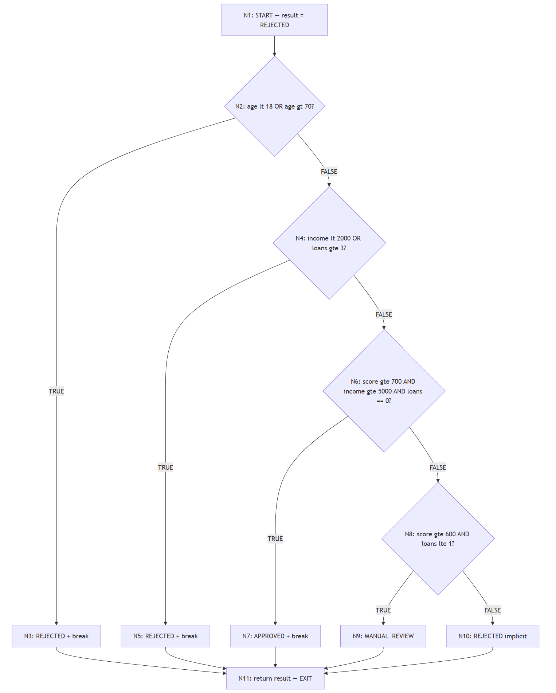
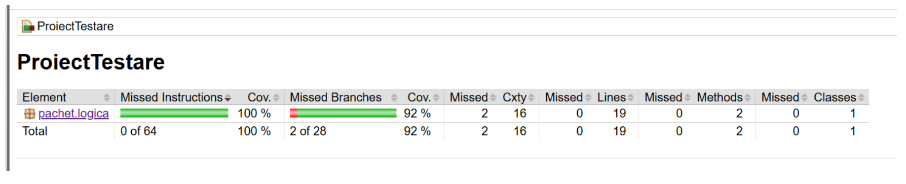
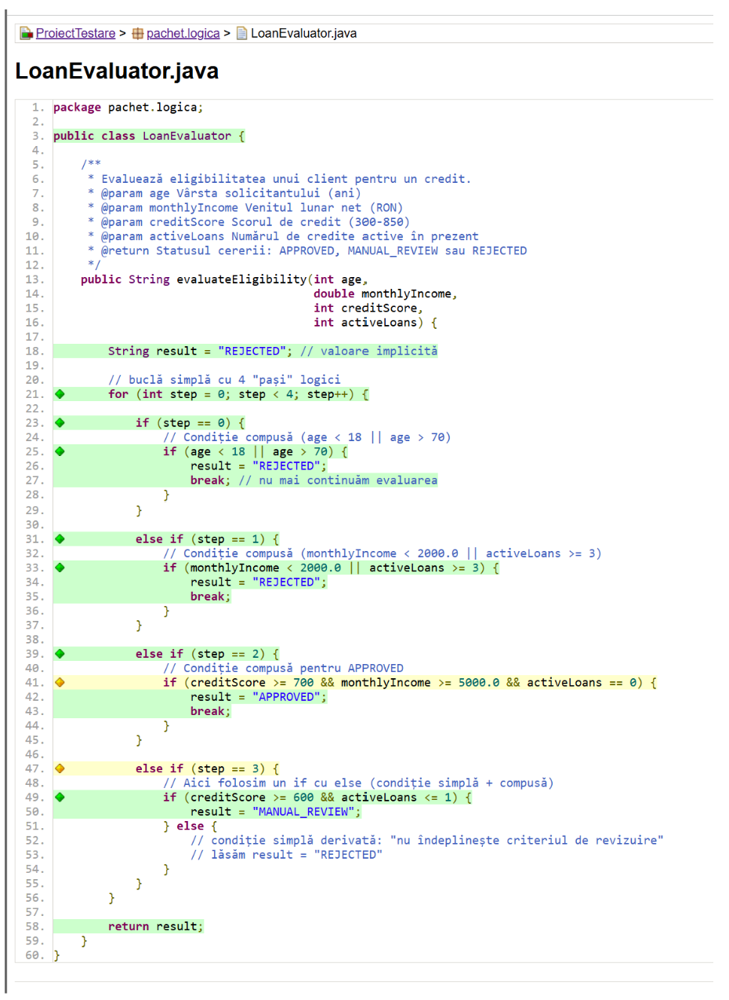
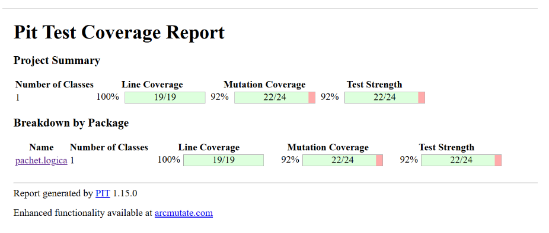
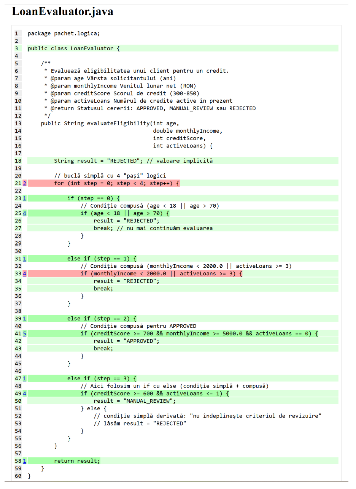
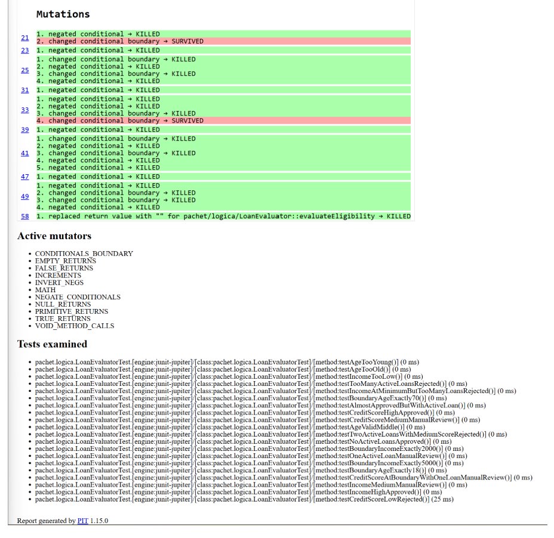

# Proiect T3 – Testare unitară în Java  - Teodor Alexandru-Mihai
## Evaluator de credite – `LoanEvaluator`

Acest proiect face parte din tema T3 („Testare unitară în Java”) la disciplina **Testarea sistemelor software**. Scopul este să definesc o funcționalitate de complexitate medie, să o implementez în Java și să o testez folosind tehnicile discutate la curs: testare funcțională, testare structurală, mutation testing și integrare continuă.

Funcționalitatea aleasă este un **evaluator de eligibilitate pentru credite bancare**. Clasa principală se numește `LoanEvaluator` și conține logica de decizie pentru aprobarea sau respingerea unei cereri de credit.

***

## 1. Specificația funcției `LoanEvaluator`

### 1.1. Descriere generală

Componenta centrală este clasa:

```java
public class LoanEvaluator {
    public String evaluateEligibility(int age,
                                      double monthlyIncome,
                                      int creditScore,
                                      int activeLoans) {
        ...
    }
}
```

Metoda `evaluateEligibility` primește patru parametri:

- `age` – vârsta solicitantului (în ani);  
- `monthlyIncome` – venitul net lunar (în lei);  
- `creditScore` – scorul de credit;  
- `activeLoans` – numărul de credite active curente.

Metoda întoarce unul dintre următoarele string-uri:

- `APPROVED` – cerere aprobată automat;  
- `MANUAL_REVIEW` – cerere care trebuie analizată manual de un ofițer;  
- `REJECTED` – cerere respinsă.

### 1.2. Reguli

Regulile după care se ia decizia sunt:

1. **Vârstă validă**  
   - Dacă `age < 18` sau `age > 70`, cererea este imediat respinsă (`REJECTED`).  
   - Doar clienții cu vârsta între 18 și 70 de ani (inclusiv) pot merge mai departe în procesul de evaluare.

2. **Filtru minim de venit și credite active**  
   - Dacă `monthlyIncome < 2000` sau `activeLoans >= 3`, cererea este respinsă (`REJECTED`), indiferent de scorul de credit.

3. **Client ideal – aprobare automată**  
   - Dacă `creditScore >= 700`, `monthlyIncome >= 5000` și `activeLoans == 0`, cererea este aprobată automat (`APPROVED`).

4. **Client de risc mediu – analiză manuală**  
   - Dacă `creditScore >= 600` și `activeLoans <= 1`, dar nu sunt îndeplinite condițiile de client ideal, cererea se trimite la revizuire manuală (`MANUAL_REVIEW`).

5. **Cazuri rămase**  
   - În toate celelalte situații (de exemplu scor prea mic, combinații nefavorabile de venit și credite), cererea este respinsă (`REJECTED`).

### 1.3. Parametri și restricții – tabel

| Parametru       | Descriere                        | Domeniu / restricții principale                               |
|-----------------|----------------------------------|----------------------------------------------------------------|
| `age`           | vârsta solicitantului            | `<18` sau `>70` → respins; `18–70` → analiză normală          |
| `monthlyIncome` | venit net lunar (lei)            | `<2000` → respins; `2000–4999` → minim; `>=5000` → venit mare |
| `creditScore`   | scor de credit                   | `<600` → risc mare; `600–699` → risc mediu; `>=700` → foarte bun |
| `activeLoans`   | număr de credite active          | `>=3` → respins; `0` → ideal; `1–2` → acceptabil pentru risc mediu |

***

## 2. Structura proiectului

Proiectul este un **proiect Maven** Java, organizat astfel:

```text
src/
  main/
    java/
      pachet/logica/
        LoanEvaluator.java
  test/
    java/
      pachet/logica/
        LoanEvaluatorTest.java

pom.xml
.github/
  workflows/
    maven.yml
```

- `LoanEvaluator.java` – implementarea logicii de business;  
- `LoanEvaluatorTest.java` – testele unitare JUnit 5;  
- `pom.xml` – configurare Maven, dependențe JUnit 5, JaCoCo, PIT;  
- `.github/workflows/maven.yml` – workflow pentru integrare continuă (GitHub Actions).

***

## 3. Testare funcțională

În testarea funcțională am lucrat după specificație (black-box), fără să mă uit inițial în cod. Am folosit:

- partiționare în clase de echivalență;  
- analiza valorilor de frontieră.

### 3.1. Clase de echivalență individuale

#### 3.1.1. Vârsta (`age`)

- **A1 – vârstă prea mică**: `age < 18` → cererea trebuie respinsă.  
- **A2 – vârstă validă**: `18 ≤ age ≤ 70` → se continuă evaluarea.  
- **A3 – vârstă prea mare**: `age > 70` → cererea trebuie respinsă.

#### 3.1.2. Venitul lunar (`monthlyIncome`)

- **I1 – venit sub prag**: `monthlyIncome < 2000` → respins.  
- **I2 – venit minim/mediu**: `2000 ≤ monthlyIncome < 5000`.  
- **I3 – venit mare**: `monthlyIncome ≥ 5000`.

#### 3.1.3. Scorul de credit (`creditScore`)

- **C1 – scor scăzut**: `creditScore < 600`.  
- **C2 – scor mediu**: `600 ≤ creditScore < 700`.  
- **C3 – scor mare**: `creditScore ≥ 700`.

#### 3.1.4. Numărul de credite active (`activeLoans`)

- **L1 – niciun credit activ**: `activeLoans = 0`.  
- **L2 – puține credite**: `activeLoans = 1` (sau 2, în funcție de interpretare).  
- **L3 – prea multe credite**: `activeLoans ≥ 3` → respins.

### 3.2. Clase de echivalență globale

Pe baza claselor individuale, am definit câteva **clase globale** care corespund scenariilor relevante:

- **G1 – client ideal (APPROVED)**  
  - age în A2, income în I3, score în C3, loans în L1;  
  - așteptat: `APPROVED`.

- **G2 – client de risc mediu (MANUAL_REVIEW)**  
  - age în A2, income în I2 sau I3, score în C2, loans în L2;  
  - așteptat: `MANUAL_REVIEW`.

- **G3 – vârstă invalidă (REJECTED)**  
  - age în A1 sau A3;  
  - așteptat: `REJECTED`.

- **G4 – venit sub prag (REJECTED)**  
  - age în A2, income în I1;  
  - așteptat: `REJECTED`.

- **G5 – prea multe credite active (REJECTED)**  
  - age în A2, loans în L3;  
  - așteptat: `REJECTED`.

- **G6 – scor de credit prea mic (REJECTED)**  
  - age în A2, score în C1;  
  - așteptat: `REJECTED`.

### 3.3. Analiza valorilor de frontieră

Am identificat frontierele:

- pentru vârstă: 18 și 70;  
- pentru venit: 2000 și 5000;  
- pentru scor: 600 și 700;  
- pentru număr de credite: 3.

Exemple de teste de frontieră:

- `age = 17` → respins;  
- `age = 18` cu restul parametrilor buni → nu se respinge pe vârstă;  
- `age = 70` → încă acceptat;  
- `age = 71` → respins.

- `monthlyIncome = 1999` → respins;  
- `monthlyIncome = 2000` → test pentru limita inferioară acceptată;  
- `monthlyIncome = 5000` → prag pentru venit mare.

- `creditScore = 599` vs `600` vs `700` → se testează trecerea între scor scăzut, mediu și mare.

- `activeLoans = 2` vs `3` → se verifică pragul la care încep respingerile automat pe număr de credite.

### 3.4. Tabel de teste funcționale

O selecție de teste (în cod există mai multe, dar ideea este asta):

| ID  | age | income | score | loans | Clase globale acoperite | Rezultat așteptat |
|-----|-----|--------|-------|-------|-------------------------|-------------------|
| T1  | 17  | 5000   | 750   | 0     | G3 (A1)                 | REJECTED          |
| T2  | 71  | 5000   | 750   | 0     | G3 (A3)                 | REJECTED          |
| T3  | 30  | 1500   | 750   | 0     | G4 (I1)                 | REJECTED          |
| T4  | 30  | 5000   | 750   | 3     | G5 (L3)                 | REJECTED          |
| T5  | 30  | 4000   | 550   | 0     | G6 (C1)                 | REJECTED          |
| T6  | 30  | 5500   | 750   | 0     | G1                      | APPROVED          |
| T7  | 30  | 3000   | 650   | 1     | G2                      | MANUAL_REVIEW     |

Toate aceste teste sunt implementate ca metode `@Test` în `LoanEvaluatorTest`.

***

## 4. Testare structurală

În testarea structurală (white-box) am analizat implementarea efectivă a metodei `evaluateEligibility` și am generat date de test pornind de la structura codului, nu de la specificație. Am folosit graful de flux de control (CFG) ca bază pentru definirea criteriilor de acoperire.

### 4.1. Graful de flux de control (CFG)

Programul este transformat într-un graf orientat în care fiecare nod reprezintă o instrucțiune sau o secvență de instrucțiuni, iar fiecare arc reprezintă un transfer de control. Convenția urmată este cea din curs: noduri dreptunghiulare pentru instrucțiuni, noduri romb pentru decizii.

**Numerotarea nodurilor:**

| Nod | Instrucțiune / Decizie |
|-----|------------------------|
| N1  | `String result = "REJECTED"` ← START |
| N2  | `if (age < 18 \|\| age > 70)` ← D1 |
| N3  | `result = "REJECTED"; break` (D1-True) |
| N4  | `if (monthlyIncome < 2000.0 \|\| activeLoans >= 3)` ← D2 |
| N5  | `result = "REJECTED"; break` (D2-True) |
| N6  | `if (creditScore >= 700 && monthlyIncome >= 5000.0 && activeLoans == 0)` ← D3 |
| N7  | `result = "APPROVED"; break` (D3-True) |
| N8  | `if (creditScore >= 600 && activeLoans <= 1)` ← D4 |
| N9  | `result = "MANUAL_REVIEW"` (D4-True) |
| N10 | result rămâne `"REJECTED"` implicit (D4-False) |
| N11 | `return result` ← EXIT |



**Metrici CFG:**
- Noduri (n) = 11
- Arce (e) = 14
- Complexitate ciclomatică: **V(G) = e − n + 2 = 14 − 11 + 2 = 5**

### 4.2. Statement coverage (acoperire la nivel de instrucțiune)

Statement coverage cere ca fiecare instrucțiune (nod din CFG) să fie executată cel puțin o dată.

> **Criteriu**: Fiecare nod N1–N11 parcurs de cel puțin un test.

| Test | `age` | `income` | `score` | `loans` | Rezultat așteptat | Instrucțiuni parcurse |
|------|-------|----------|---------|---------|-------------------|-----------------------|
| `testAgeTooYoung()` | 17 | 5000.0 | 700 | 0 | `REJECTED` | N1, N2, **N3**, N11 |
| `testIncomeTooLow()` | 30 | 1500.0 | 700 | 0 | `REJECTED` | N1, N2, N4, **N5**, N11 |
| `testAgeValidMiddle()` | 30 | 5000.0 | 700 | 0 | `APPROVED` | N1, N2, N4, N6, **N7**, N11 |
| `testIncomeMediumManualReview()` | 30 | 3000.0 | 650 | 1 | `MANUAL_REVIEW` | N1, N2, N4, N6, N8, **N9**, N11 |
| `testCreditScoreLowRejected()` | 30 | 5000.0 | 550 | 0 | `REJECTED` | N1, N2, N4, N6, N8, **N10**, N11 |

Cu aceste 5 teste sunt parcurse toate nodurile N1–N11 → **100% statement coverage**.

JaCoCo confirmă 100% instruction coverage pentru clasa `LoanEvaluator`.

### 4.3. Branch coverage (acoperire la nivel de ramură)

Branch coverage este o extensie naturală a statement coverage: cere ca fiecare ramură True și False a fiecărei decizii să fie exercitată de cel puțin un test.

> **Criteriu**: Fiecare arc din CFG (ramură True/False) parcurs cel puțin o dată.

**Deciziile și ramurile lor:**

| ID | Decizie | Ramură True | Ramură False |
|----|---------|-------------|--------------|
| D1 | `age < 18 \|\| age > 70` | → N3 (REJECTED + break) | → N4 |
| D2 | `monthlyIncome < 2000.0 \|\| activeLoans >= 3` | → N5 (REJECTED + break) | → N6 |
| D3 | `creditScore >= 700 && monthlyIncome >= 5000.0 && activeLoans == 0` | → N7 (APPROVED + break) | → N8 |
| D4 | `creditScore >= 600 && activeLoans <= 1` | → N9 (MANUAL_REVIEW) | → N10 (REJECTED implicit) |

**Tabel teste pentru branch coverage:**

| Test | `age` | `income` | `score` | `loans` | Rezultat așteptat | Ramuri acoperite |
|------|-------|----------|---------|---------|-------------------|-----------------|
| `testAgeTooYoung()` | 17 | 5000.0 | 700 | 0 | `REJECTED` | **D1-True** |
| `testAgeTooOld()` | 71 | 5000.0 | 700 | 0 | `REJECTED` | **D1-True** |
| `testIncomeTooLow()` | 30 | 1500.0 | 700 | 0 | `REJECTED` | D1-False, **D2-True** |
| `testTooManyActiveLoansRejected()` | 30 | 5000.0 | 720 | 3 | `REJECTED` | D1-False, **D2-True** |
| `testAgeValidMiddle()` | 30 | 5000.0 | 700 | 0 | `APPROVED` | D1-False, D2-False, **D3-True** |
| `testIncomeMediumManualReview()` | 30 | 3000.0 | 650 | 1 | `MANUAL_REVIEW` | D1-False, D2-False, D3-False, **D4-True** |
| `testCreditScoreLowRejected()` | 30 | 5000.0 | 550 | 0 | `REJECTED` | D1-False, D2-False, D3-False, **D4-False** |

Aceste 7 teste acoperă toate ramurile True și False ale celor 4 decizii → **100% branch coverage**.

### 4.4. Condition coverage (acoperire la nivel de condiție)

Condition coverage cere ca fiecare sub-condiție individuală dintr-o decizie compusă să ia atât valoarea `True` cât și valoarea `False`.

> **Criteriu**: Fiecare condiție atomică ia ambele valori în setul de teste.

**Condiții atomice identificate:**

| Decizie | Sub-condiții atomice |
|---------|----------------------|
| D1 | `age < 18` , `age > 70` |
| D2 | `monthlyIncome < 2000.0` , `activeLoans >= 3` |
| D3 | `creditScore >= 700` , `monthlyIncome >= 5000.0` , `activeLoans == 0` |
| D4 | `creditScore >= 600` , `activeLoans <= 1` |

**Tabel condition coverage** (T = True, F = False, — = nu se evaluează):

| Test | `age<18` | `age>70` | `inc<2k` | `loans≥3` | `sc≥700` | `inc≥5k` | `loans=0` | `sc≥600` | `loans≤1` | Rezultat |
|------|----------|----------|----------|-----------|----------|----------|-----------|----------|-----------|----------|
| `testAgeTooYoung()` | **T** | F | — | — | — | — | — | — | — | REJECTED |
| `testAgeTooOld()` | F | **T** | — | — | — | — | — | — | — | REJECTED |
| `testIncomeTooLow()` | F | F | **T** | F | — | — | — | — | — | REJECTED |
| `testTooManyActiveLoansRejected()` | F | F | F | **T** | — | — | — | — | — | REJECTED |
| `testCreditScoreLowRejected()` | F | F | F | F | **F** | T | T | **F** | T | REJECTED |
| `testAlmostApprovedButWithActiveLoan()` | F | F | F | F | T | T | **F** | T | T | MANUAL_REVIEW |
| `testAgeValidMiddle()` | F | F | F | F | **T** | **T** | **T** | T | T | APPROVED |
| `testIncomeMediumManualReview()` | F | F | F | F | F | **F** | F | **T** | **T** | MANUAL_REVIEW |
| `testTwoActiveLoansWithMediumScoreRejected()` | F | F | F | F | F | F | F | T | **F** | REJECTED |

Fiecare sub-condiție atomică ia ambele valori → **100% condition coverage**.

***

## 5. Code coverage (JaCoCo)

Plugin-ul **JaCoCo** este configurat în `pom.xml`. După:

```bash
mvn test
```

se generează un raport în:

```text
target/site/jacoco/index.html
```

**Raport JaCoCo – sumar:**



**Acoperire instrucțiuni în cod:**



***

## 6. Mutation testing (PIT)

Pentru a verifica „puterea” testelor, am folosit **PIT** (pitest) ca plugin Maven:

```bash
mvn org.pitest:pitest-maven:mutationCoverage
```

Se generează un raport HTML în:

```text
target/pit-reports/<timestamp>/index.html
```

PIT introduce mutanți în cod (de exemplu schimbări de operatori, inversări de condiții etc.) și verifică dacă testele îi detectează.

**Raport PIT – sumar:**



**Acoperire linii cu mutanți:**



**Detaliu mutații KILLED / SURVIVED:**



***

## 7. Integrare continuă (GitHub Actions)

Proiectul folosește un workflow GitHub Actions definit în:

```text
.github/workflows/maven.yml
```

Workflow-ul:

- rulează la `push` și `pull_request`;  
- folosește runner `ubuntu-latest`;  
- instalează JDK 11;  
- rulează `mvn -B test --file pom.xml`.

Astfel, la fiecare modificare în repository, testele sunt rulate automat. Dacă apare o eroare, pipeline-ul devine roșu, iar problema poate fi corectată imediat.

***

## 8. Utilizarea unui asistent AI

Pe parcursul proiectului am folosit un asistent AI de tip chatbot pentru:

- clarificarea cerințelor temei T3;  
- idei de structură pentru teste și README;  
- ajutor la configurarea unor tool-uri (Maven, JaCoCo, PIT, GitHub Actions).

Codul, testele și deciziile finale îmi aparțin. Am folosit AI-ul mai degrabă pentru idei, stilizarea codului și a acestui document, verificări rapide. Am verificat manual tot ce am integrat în proiect și am validat cu JaCoCo și PIT că testele chiar acoperă logica din `LoanEvaluator`.

***

## 9. Concluzii

În acest proiect am trecut prin toți pașii importanți ai testării unei funcționalități:

- am pornit de la o specificație clară;  
- am proiectat teste funcționale pe baza claselor de echivalență și a valorilor de frontieră;  
- am analizat acoperirea structurală (statement și branch coverage) și am verificat-o cu JaCoCo;  
- am folosit mutation testing (PIT) pentru a evalua cât de robuste sunt testele;  
- am configurat un pipeline de integrare continuă care rulează automat testele la fiecare push.

Rezultatul este o suită de teste care acoperă bine logica `LoanEvaluator` și un README care documentează întregul proces direct în repository, fără documentații suplimentare în altă parte.
